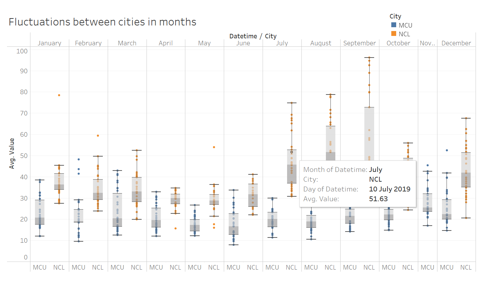
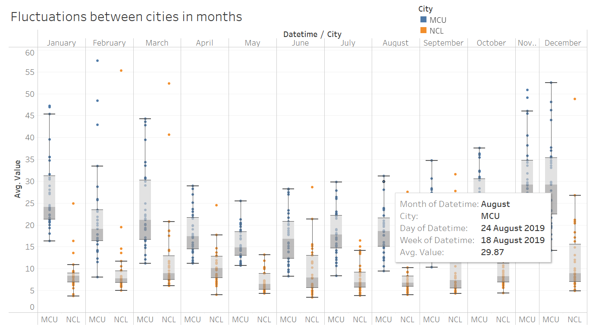
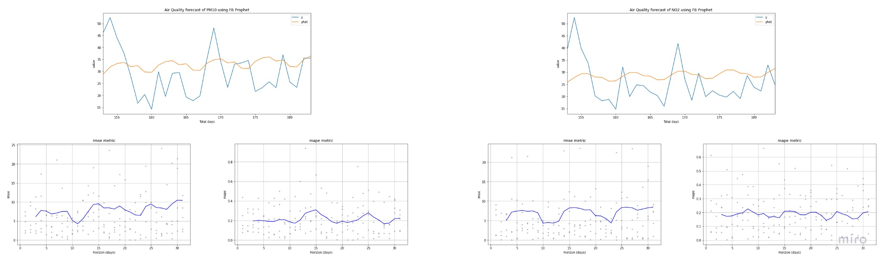
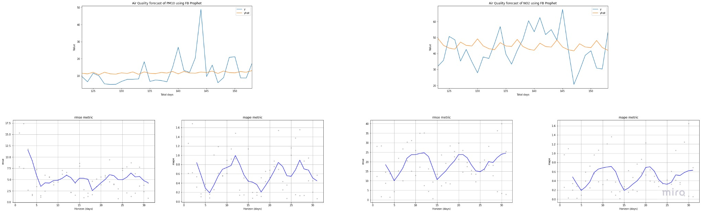
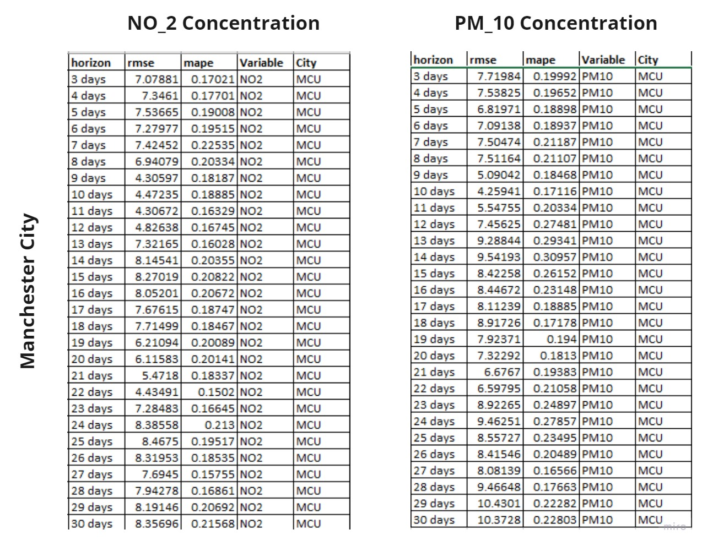
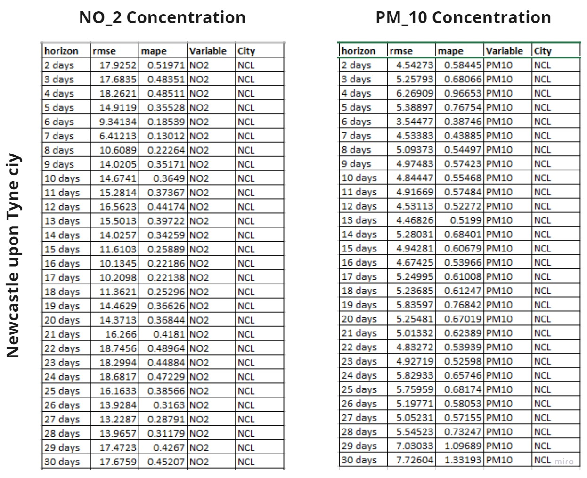

\pagenumbering{arabic}

\begingroup
\centering
# Abstract {-}
\endgroup

The purpose of this study is to compare, visualize, and forecast air quality in Manchester and Newcastle upon Tyne using data from their respective Urban Observatories. This research considers only suspended particulate matter $PM_{10}$ and nitrogen dioxide $NO_2$, in accordance with the UK's Department of the Environment's Essential Variables (EVs). Using R and Tableau, data is mined, wrangled, and graphically examined. Comparing data collected between July 2019 and July 2020 visually and statistically reveals that PM10 concentrations are greater in Manchester City, whereas NO2 concentrations are higher in Newcastle upon Tyne. While Newcastle upon Tyne has lower PM10 concentrations, the presence of numerous outlier values indicates that significant fluctuations have occurred, perhaps owing to external sources. No patterns are discernible from a geospatial visual assessment of the concentrations based on the placements of sensors in both cities. The time series prediction of concentrations by the FB Prophet model reveals the presence of trend and seasonality patterns; the model predicts values with errors, often between 10% and 20% of MAPE. The workflow of this study can be utilized to discover new methods and findings for different Air Quality Index variables and for different cities.

# Introduction

Air pollution in metropolitan areas has progressively increased over the previous few years. The air is becoming progressively polluted at an alarming rate as a result of increased industrialization and rising amounts of hazardous substances in the atmosphere. Since the outbreak of the Coronavirus pandemic, limiting air pollution has become more critical in order to counteract the virus's impacts. According to the WHO, 91% of the world's population breathes contaminated air, which is a major risk factor for non-infectious disease development. The UK Government manages ambient air quality through the Department for Environment, Food and Rural Affairs (Defra) by limiting emission sources and monitoring and managing air quality.

As a result of significant breakthroughs in IoT and sensor development, urban observatories have been constructed in a number of locations throughout the United Kingdom. These urban observatories gather essential data about their neighbourhood on a variety of topics, from air quality to traffic tracking, and store, analyse, and report on environmental and human-caused data for a variety of purposes. The number of topics and focal points varies by location and observatory. Two of the most active observatories in the United Kingdom, Manchester Urban Observatory [67] and Newcastle Urban Observatory [66], are being considered for this study. Despite the fact that both observatories share a few components, this study takes into account data on air quality acquired by sensors in both locations.

Sensors with an Air Quality theme collect data on parameters that can be used to assess the air quality in a given region. Numerous sensors have been installed across the city, and data is continuously collected 24 hours a day, seven days a week. The data observatories keep track of gas emissions and compounds known to be hazardous to humans. The sensors detect the most dangerous emissions, including tropospheric ozone ($O_3$), sulphur dioxide ($SO_2$), nitrogen dioxide ($NO_2$), benzene, suspended particulate matter ($PM_{2.5}$ and $PM_{10}$), lead, carbon monoxide, PAH, and 1,3-Butadiene. These are the Target Essential Variables (EV) defined in the United Kingdom's National Air Quality Strategy (NAQS).

## Project Objectives

Through the use of data from the respective Urban Observatories in Manchester and Newcastle upon Tyne, the study hopes to compare, visually represent, and foresee the air quality in these two cities. According to the Essential Variables (EVs) set by Defra, only suspended particulate matter $PM_{10}$ and nitrogen dioxide $NO_2$ are taken into account in this study.

More specifically, the project's goal is to do the following:

* A data pipeline to assess the Air Quality Index will be built, as well as a comparison of the fluctuations and findings in air quality between cities over time. 
* Applying time series analysis to the data will help to better identify seasonality trends and extend the analysis to forecast air quality data.

# Literature Review

Air quality index (AQI) is applied worldwide to inform the public about levels of air pollution and related to health risks. Characterizing the Air pollution and comparing the AQI in the city of Tehran were examined by Saeed Motesaddi, Yalda Hashempour, Parviz Nowrouz in [6]. As per the study two AQI's were compared - $PM_{2.5}$ and $PM_{10}$ with the data ranging from March 2007 to March 2014. The most severe difficulties in Tehran are caused by PM2.5 and PM10, which have the highest concentrations practically every year, often exceeding 100. (threshold value). PM concentration is directly linked to traffic.

The study which involves in assessing the Air Quality near traffic intersections of the Bangalore City in India during the period of 1997 to 2005 have been examined by S.M. ShivaNagendra, K.Venugopal,Steven L.Jones in [9]. As per the study, the AQIs for the criterion pollutants SO2, NOx, RSPM, and SPM are determined according to the EPA-specified protocol. The result indicates that air pollution levels at all three crossings (i.e., AQM stations) can be classified as "excellent" or "moderate" for SO2 and NOx, respectively, at all periods between 1997 and 2005. Between 1999 and 2005, the AQI values for RSPM concentrations were "good" or "moderate" 94% of the time, "poor" 5% of the time, and "very poor" and "severe" 1% of the time. According to a review of AQI readings for SPM concentrations from 1997 to 2005, 91% of the time is classified as "excellent" or "moderate," 7% as "poor," and the remaining 2% as "very poor" or "severe." Annual AQI scores for RSPM and SPM are decreasing, with an increase in the prevalence of "good" and "moderate" levels.

Another study proposed a new approach that compares the Air Quality in Europe region by creating a common alternative index as in [10]. As per the study, frequently the air quality is expressed as a scale ranging from good to bad. A survey of existing websites and air quality indices reveals significant variation in how air quality is understood. The article introduces a new air quality index. The index is a component of a larger effort to create a website dedicated to comparing the air quality of European towns. The common air quality index (CAQI) is not intended to be a substitute for current regional indices. The CAQI is comprised of two indices: one for roadside monitoring locations and another for typical city background circumstances. Distinguishing between roadside and urban environments is a necessary first step toward ensuring consistency in the metrics being examined.

An experiment was carried out on the visual exploration of Air Quality data [16]. The study introduces a novel data structure called the TCP tree, which captures both the variable hierarchy and temporal fluctuation of correlations concealed in air quality data. The case study on a real-world dataset demonstrates that such a hierarchical structure can aid in information-theoretically exploiting the sparsity of a large-scale air quality time series.

Another study that involves in visual exploration of the Air Quality data were carried by Dezhan Qu, Xiaoli Lin, Ke Ren, Quanle Liu and Huijie Zhang [21]. In this study,a comprehensive visual analytics solution for visualising air quality data was proposed. Several unique visualisation approaches have been integrated into the system and applied to the analysis of China's air pollution problem, revealing some interesting trends. To assess data's temporal and multivariate qualities concurrently, a novel RadViz view was created in which not only the multivariate features are displayed clearly, but also the time-varying trend is easily detected without visual clutter. Then, using the sketch-based interaction, an efficient time-series querying method to assist users in accurately searching any required patterns was constructed. Additionally, a variety of coordinated views to evaluate and compare air quality patterns among cities, including a word cloud view, a dashboard view, and a map view were created. Finally, three case studies utilising public air quality data and user comments to demonstrate the system's usefulness were provided.

Yao Shen, Stephan Lehmler, Syed Monjur Murshed and Till Riedel co-authored a research which compares different machine learning approach using visual interface [24]. This article used geographical features and high-quality mobile measurement data to estimate air quality in Augsburg. The data from OSM were retrieved, analysed and discovered high-resolution spatial features such as the types and areas of various land uses, as well as road networks. Appropriate machine-learning techniques were used and compared model performance via a graphical user interface (dashboard). At the conclusion of this study, a dashboard was created to illustrate the analysis's workflow, which included data exploration, correlation analysis, model comparison, and the inference of air quality for a new metro region with fine granularity.

The paper [32] presents a visual analytical system for air quality analysis. Three distinct perspectives are integrated into the system. The spatial distribution of stations and the state of various locations are analysed using a map-based view. A calendar display provides viewers with information on the cyclical nature of air quality. This calendar view is a combination of an Overview and Detail view. When we identify interesting patterns in the map-based or trend views, we may go into the data to discover cyclic trends for each hour of the day. Two line charts can be used to illustrate the quality trend in a trend view. As with the calendar view, the trend view is divided into two critical sections. These two sections are organised around the concept of Focus + Context.

The Study [42] provides guidance over the use of different T-tests. As per the study, When the distribution of measurements is close to normal or symmetrical with at least 50 measurements, the Welch t-test is recommended to the Student's t-test. In terms of statistical power, there is minimal difference. The Mann–Whitney U-test, on the other hand, is nearly as powerful and makes no distributional assumptions. The Welch t-test determines whether there is a difference in means, while the Mann–Whitney U-test determines whether there is a difference in medians.

In the study [46], the objective is to evaluate the Time Series forecasting models for estimating the AQI. This article examined and predicted PM2.5 levels at 12 station locations using four models: ARIMA, FBProphet, LSTM, and CNN. For the majority of stations, LSTM outperformed all other models in terms of RRSE, RMSE, MAPE, and MAE assessment criteria. The trend analysis demonstrates that ARIMA and FBProphet failed to correctly predict smaller values, resulting in a large MAPE error.

Another study involves in the time series forecasting analysis by using SARIMA and FB-Prophet model [54]. Two techniques to pollution forecasting have been offered in this article, both of which are based on historical data spanning the years 2005 to 2015. The proposed model forecasted 2016 pollution values. We conducted a comparison of the model's performance indicators. Both the SARIMA and prophet models have a high level of accuracy. However, the optimal strategy is the prophet model with log transformation because it has the lowest RMSE and MSE values. The findings demonstrate the viability of employing time series forecasting models, specifically the Prophet model, to estimate future pollution levels and develop an early warning system for public safety.

## About Air Quality Index

The AURN [3] is the largest automatic monitoring network in the United Kingdom and is the primary network for reporting compliance with the Ambient Air Quality Directives. It consists of automated air quality monitoring stations that measure nitrogen oxides (NOx), sulphur dioxide (SO2), ozone (O3), carbon monoxide (CO), and particulate matter (PM) (PM10, PM2.5). These sites deliver high-resolution hourly information to the public via a variety of electronic, media, and web platforms.

On behalf of Defra and the Devolved Administrations [4], the Environment Agency manages the UK's national monitoring sites. There are around 300 Environment Agency-managed monitoring sites in the UK that measure air quality. These sites are organised into networks that collect specific types of data using specific methods. The pollutants assessed and the method employed by each network are determined by the network's purpose and the intended use of the data.

Air quality in the UK is influenced not just by emissions covered by the NAEI, but also by secondary generation of air pollutants, emissions from countries other than the UK, and geographical and meteorological factors. The United Kingdom monitors air quality on a national scale using a network of monitoring stations. The Automatic Urban and Rural Network (AURN) is the network that monitors the most well-known pollutants and transmits data hourly in near real-time on the UK-AIR website. On the website, users can download historical hourly data for each monitoring site from the UK-AIR database, in addition to a range of other data tools [11].

## About Time series Data Mining

After over two decades of research in time series data mining [14], an astounding array of systems and techniques have been presented. Due to time series' pervasive nature, their range of applications has expanded along with the development of more mature and efficient solutions to issues of growing computing complexity. Time-series data mining techniques are presently used in a wide variety of domains, from economics to medical surveillance and climate forecasting, to biology, hydrology, genetics, and musical inquiry. Numerous facets of complexity develop while analysing time series data, owing to its large dimensionality and the difficulty of defining an effective similarity metric based on human perception.

In this paper [15], We conducted a review of the studies on time series data mining in this study. Diverse research has concentrated on one or more issues related to time series data mining. However, due to the peculiar nature of time series data, current research is insufficient, and it is regarded as one of the ten most difficult challenges in data mining (Yang and Wu, 2006). Time series data's high dimensionality complicates the application of existing data mining techniques. As a result, developing a more effective and efficient time series representation technique is critical.

## About Technologies

Nowadays, in the age of Big Data, the capacity to deliver information plainly and simply is gaining relevance. However, traditional databases are incapable of storing the volume and variety of data that is generated on a daily basis. That is why businesses are increasingly turning to Hadoop, Spark, and NoSQL databases to satisfy their fast expanding data analysis requirements. Users can incorporate R encodings into computed fields in Tableau. Tableau's interface with R enables users to pass data from Tableau to the R engine, execute data calculations, and then return the data to Tableau [31].

The research work involves in developing a Python-based data analytical tool with the goal of simplifying the data mining, analysis, and visualisation processes. This library might be a lifesaver for data scientists, analysts, and business intelligence professionals. We demonstrate our library's basic architecture, which includes base modules such as feature engineering, which contains functions and methods for feature cleaning and extraction; modelling, which contains functions for developing and testing machine learning models; structdata, which contains functions for working with structured, tabular datasets; and timeseries, which contains functions for working with time series data [38].

## About FB-Prophet model

Prophet [65] is a time series forecasting process that uses an additive model to accommodate non-linear trends with yearly, weekly, and daily seasonality, as well as holiday impacts. It works best with time series that have substantial seasonal impacts and historical data spanning multiple seasons. Prophet is resistant to missing data and trend alterations, and often performs well with outliers.

For the purpose of this study, only $NO_2$ and $PM_{10}$ concentrations are considered for comparing between the cities and forecasting through the timeline using FB-Prophet model. The R and Python languages are predominantly used for Data Preparation, Data Mining and building model for time series predictive analysis. Tableau tool has been used for creating interactive dashboards for visual Analysis.

# Methodology

## Data Analysis

### Data Understanding and Data Preparation

The data on air quality in both Manchester and Newcastle upon Tyne are available for public use in their respective Urban Observatories. The Newcastle Urban Observatory monitors and records data at a minute-granularity, whereas the Manchester Urban Observatory monitors and records data at a 15-minute-granularity. Furthermore, the Newcastle Urban Observatory has the capability of accessing the dataset using APIs, but the data for Manchester city must be obtained manually from the Manchester Urban Observatory.

When preparing the data, the data for Manchester was manually downloaded from the Manchester Urban Observatory webpage, and the postcodes for each sensor in the city were manually updated as part of the data preparation process. After completing the data preparation stage, the final data set contains five variables.

Table: Dataset description of Manchester

| **Variable Name** | **Class** | **Information**                            |
|-------------------|-----------|--------------------------------------------|
| Timestamp         | Character | Time series of the data recorded           |
| NO2               | Numeric   | Value of the sensor recorded               |
| PM10              | Numeric   | Value of the sensor recorded               |
| StationName       | Character | Station name which the sensor is located   |
| PostCodes         | Character | Location of the sensor                     |

The data for Newcastle upon Tyne has been downloaded from the Newcastle Urban Observatory portal using the API (application programming interface). After completing the data preparation stage, the final data set contains five variables.

Table: Dataset description of Newcastle

| **Variable Name** | **Class** | **Information**                            |
|-------------------|-----------|--------------------------------------------|
| Sensor.Name       | Character | The name of the sensor which records data  |
| Variable          | Character | The Essential Variables from the data      |
| Timestamp         | Character | Time series of the data recorded           |
| Value             | Numeric   | Value of the EV's recorded                 |
| Location..WKT.    | Character | Location of the sensor                     |

### Data Mining

The Project Template Package, which is written in the R programming language, has been used mostly for pre-processing the data. During the initial stages of this study, data from the month of February in the year 2020 is taken into consideration, and the time span is then extended after the data pipeline for the analysis has been completed. Manually downloading the data for Manchester has resulted in the data being stored in distinct files based on the location of each of the stations. It was necessary to manually update the postcodes of each station, which would aid in the future analysis process. Python has been used to join the datasets together and create a single data file from them. R's Project Template has been configured to save the combined dataset in the data folder of the Project Template package.

The Newcastle data has been downloaded from the Newcastle Urban Observatory portal using the API, and the resulting dataset has been saved in the data folder of the Project Template. The N/A values have been removed from both the cities datasets. Preparation of the data includes assigning valid data types to the variables and converting postcodes into Latitude and Longitude coordinates in order to create a geospatial display of EV concentrations. Due to the fact that both datasets had a variable Timestamp that was in text format, they were converted to date format, and the new variables "date" and "hour" were created from the Timestamp variable.

### Visual Representation

Specifically, the datasets obtained from the Data Preparation process have been stored in such a way that one file contains the $NO_2$ concentration between Newcastle upon Tyne city and Manchester city, and another file contains the $PM_{10}$ concentration between Newcastle upon Tyne city and Manchester city. Tableau has been widely used for visual representation, particularly in the creation of dashboards. The visualization was created using three different granularity levels, which allows for a more in-depth understanding and visual representation of the outcome in each city.

### Geospatial Representation

There are locations for each sensor that has been installed in the various cities included in the dataset. The dataset for Newcastle upon Tyne city contains the Latitude and Longitude values of each sensor site in a single "Location..WKT." variable. As part of the data mining process, the column is divided in order to obtain the Latitude and Longitude information individually. In contrast, the Manchester Urban Observatory website only provided postcode information for the city of Manchester, rather than the Latitude-Longitude information. Because of this, the postal codes for each station are manually entered, and the postcodes are then translated into latitudes and longitudes through the Data Mining process once they have been processed.

The geospatial visualization has been created with the Location based variables in Tableau using MapBox - OpenStreetMaps visualisation, and the values of each concentration are aggregated on a weekly basis using the MapBox - OpenStreetMaps visualization. The visualization was created to determine the crucial location over the week.

### Statistical Analysis

The statistical study was carried out on the two cities' datasets in order to statistically understand the difference in Air Quality between the cities and the EVs. The use of hypothesis testing has been proposed for the purpose of undertaking statistical analysis that compare the quality of air between different cities.

#### Welch T-Test

When comparing the two EVs, the Welch T-Test was used to determine which was more favorable. The dataset obtained for creating geospatial visualization has been used, and the data has been filtered and stored separately for each city. The values of $NO_2$ and $PM_{10}$ for each city are saved separately in an array, from which the Welch T-test was performed.

## Predictive Analysis

The FB-Prophet model has been used to forecast the Time-Series data of the Air Quality datasets for both Manchester and Newcastle upon Tyne. A function has been developed for fitting the model with the necessary training data, which would be useful for forecasting the Air Quality in a given location. The model has been trained from July $1^{st}$ 2019 to November $30^{th}$ 2019 by setting the daily seasonality to True. When the model was constructed, it was designed to forecast for the next 30 days. The MSE, RMSE, MAE, MAPE, and MDAPE are the performance metrics that are computed from the forecasting FB-Prophet model.

# Results

**Visual Representation:**

The dashboards are created using Tableau and are broken down into multiple levels of granularity, such as hours, days, and weeks, for both the $NO_2$ and $PM_{10}$ EV data. Both cities' readings are displayed by two different hues on the graph. A week-based filter has been applied to the hourly granularity based graph, allowing the concentration distribution over different weeks to be identified more clearly.

{ width=95%, height=250 }

The **Figure 1** depicts the dashboard that was developed for the $NO_2$ concentration over time.
\newpage

{ width=95%, height=250 }

Displayed in **Figure 2** is the dashboard that was developed for the $PM_{10}$ concentration over time.

The distributions across the cities at each concentrations where generated, which improves the findings for the reason behind the fluctutaions of the concentration values over the course of each month's calender day.

{ width=95%, height=250 }

The **Figure 3** depicts the daily distribution of the $NO_2$ concentration by Months in the two cities, as represented by a boxplot. The specifics reflect the total value over the course of each month's calendar day.
\newpage

{ width=95%, height=250 }

The **Figure 4** depicts the daily distribution of the $PM_{10}$ concentration by Months in the two cities, as represented by a boxplot. The specifics reflect the total value over the course of each month's calendar day.

**Geospatial Representation:**

Geospatial visualizations are created with location-based variables by utilising MapBox - OpenStreetMaps visualization with Tableau and the OpenStreetMaps visualization. Dashboards are built for the $NO_2$ and $PM_{10}$ concentrations of both cities, with one dashboard generated for each of the two concentrations. Each dot on the map symbolizes the position of a sensor or station, and the color scheme is chosen in such a way that it represents the concentration of very poor to very good Air Quality on a weekly basis, respectively.

{ width=95%, height=250 }

The geospatial representation of $NO_2$ concentration is depicted in **Figure 5** based on the position of the sensor.
\newpage

{ width=95%, height=250 }

The geospatial representation based on the position of the sensor for $PM 10$ concentration is depicted in **Figure 6**.

**Statistical Analysis - Welch T-test:**

In order to account for unequal variance, a Welch T-Test was conducted, which revealed that the differences between the cities were statistically significant in both $NO_2$ and $PM_{10}$ levels. The mean value of the MCU city for $NO_2$ concentration was 21.9 (standard deviation = 18.1), but the mean value of the NCL city was 39.5 (standard deviation = 154). Similarly, the mean value of the MCU city for the $PM_{10}$ concentration was 22.5 (standard deviation = 18), but the mean value of the NCL city was 9.91 (standard deviation = 27.2). 

Table: Welch T-Test description

| **EV's** | **Cities** | **n-values** | **Mean** | **SD** | **T-Statistic** | **DF**       | **p-value**     |
|----------|------------|--------------|----------|--------|-----------------|--------------|-----------------|
|   NO2    |   MCU      |  89434       |  21.9    |  18.1  | -105.44         |  1035866.15  |  < $2.2e^{-16}$ |
|          |   NCL      |  977507      |  39.5    |  154   |                 |              |                 |
|----------|------------|--------------|----------|--------|-----------------|--------------|-----------------|
|   PM10   |   MCU      |  89434       |  22.5    |  18.0  |   171.22        |  191332.3    |  < $2.2e^{-16}$ |
|          |   NCL      |  407643      |  9.91    |  27.2  |                 |              |                 |

On the basis of the information received from the Welch T-Test, the **Table 3** has been prepared. 

**Predictive Analysis - FB Prophet model:**

In order to train the FB-Prophet model, data from July $1^{st}$, 2019 to November $30^{th}$, 2019 was used, and the data was projected for a 30-day period (December $1^{st}$, 2019 - December $31^{st}$, 2019). In accordance with the predictions, three graphs are generated for each of the EVs ($NO_2$ and $PM_{10}$) - In this graph, the predicted concentration value is displayed against the original concentration value, and the performance metrics RMSE and MAPE are plotted against the number of days remaining on the Horizon (the range of days in forecasting).
\newpage

{ width=95%, height=250 }

**Figure 7** depicts the graphs generated based on the forecasts of the $NO_2$ and $PM_{10}$ variables for the city of Manchester.

{ width=95%, height=250 }

**Figure 8** depicts the graphs generated based on the forecasts of the $NO_2$ and $PM_{10}$ variables for the city of Newcastle upon Tyne.

# Discussion

The data from the sensors gets recorded at the Newcastle Urban Observatory on a minute-by-minute basis. And these data may be downloaded for public use and research purposes using one of two methods: either by manual download or through an API. The data can be retrieved for a given theme and timeframe by using one of these methods. The Manchester Urban Observatory, on the other hand, records the data from the sensors every 15 minutes and allows users to retrieve the data only through a manual process. As a result, all other EV's are not recorded at each station in the city of Manchester, causing this study to be limited to solely $NO_2$ and $PM_{10}$ EV's. The Newcastle Urban Observatory has been equipped with 36 sensors that monitor the air quality at various locations throughout the city of Newcastle upon Tyne. The Manchester Urban Observatory, on the other hand, only has 12 stations that monitor the air quality in the city of Manchester.

The concentration values of both $NO_2$ and $PM_{10}$ AQIs are aggregated based on three granularities - Hours, Days and Weeks. Due to some fluctuations in the Hourly aggregated data, the graph shows some spikes in both the cities at some of the weeks, where the hourly graph is further filtered upon weeks to visualize the hourly concentration level on each week. The graph aggregated towards Days and Weeks are considered upon comparing the highly polluted city.

Further investigation has been carried out on identifying the cause of the fluctuations over the daily data. The analysis is carried out by visualizing the distribution of the AQIs by days of each month and city. There occurs to be huge outliers and these outliers lie on different cities at different AQI's concentration levels. Thus results in the huge fluctuation over the days and this precisely impacts the average concentration level to increase on particular days.

To analyse and identify whether or not there is a trend in fluctuation of the concentration levels based on the sensors/stations location, a Geospatial visualization is utilized by aggregating the AQI's concentration values to a weekly basis and the color hue segregation is created that ranges from Very poor to Very Good Air Quality to identify which location sensor is taking high readings. This information could be utilized to identify whether the sensor is malfunctioning or not based on the color hue representation. 

Though the study can be concluded by comparing the Visual Analysis alone for identifying which city is performing good or bad, due to unequal total number of observations resulted in unequal variance. Hence, Hypothesis testing should be involved which could enable the study to statistically compare the concentration between the cities. Welch T-Test was employed which identifies the mean difference between the cities among the AQIs concentration.

Further extension of the study involves in predicting the concentration of EV's across the cities. In this study, the predictive analysis was carried out using Time Series Analysis in conjunction with the FB-Prophet model. It is clear that a trend can be observed when forecasting using historical data. The Performance Metrics RMSE and MAPE are shown versus the number of days remaining on the horizon. The **Figure 9** and **Figure 10** in the **Appendix** displays the performance metric values that were acquired across the horizon days based on the forecasting.

Despite the fact that the study's primary focus is on comparing the Air Quality Index between two cities, there are some external factors that have an impact on the amount of EVs that are released into the environment. Some of the criteria that may be considered are traffic information, population density in the surrounding area, and weather information. These elements will have an impact on the emissions of EV's and the future scope of the study will include dealing with all of the aspects that will aid in the analysis of the Air Quality Index between cities or within cities in the future.

# Future Implications

The future implications of this work would be to better understand the effect that external factors have on air quality. The data for those variables that are available will be included, and further analysis will be conducted to formulate a comparison between the two cities. Additionally, the predictive analysis would require the use of Neural Network models, which have a lower error rate when forecasting Air Quality data.

# Conclusion

Therefore, based on the visual and statistical comparisons made on collected data between July 2019 and July 2020, it has been discovered that $PM_{10}$ concentrations are greater in Manchester City, whereas $NO_2$ concentrations are higher in Newcastle upon Tyne. Despite the fact that the final results indicate that Newcastle upon Tyne has lower $PM_{10}$ concentrations, the presence of multiple outlier numbers indicates that there have been significant fluctuations that may have been caused by external influences. The geospatial visual analysis of the concentrations, which is based on the position of sensors in both cities, reveals that there are no patterns. Though time series prediction of concentrations using the FB Prophet model implies the presence of trend and seasonality patterns, however, the model itself forecasts values with non-significant errors, with errors ranging between 10 and 20% of MAPE on average.

# References

[1]
R. J. C. Brown et al., “Ten years of mercury measurement at urban and industrial air quality monitoring stations in the UK,” Atmospheric Environment, vol. 109, pp. 1–8, May 2015, doi: 10.1016/j.atmosenv.2015.03.003.

[2]
F. Bruno and D. Cocchi, “A unified strategy for building simple air quality indices,” Environmetrics, vol. 13, no. 3, pp. 243–261, 2002, doi: 10.1002/env.512.

[3]
F. and R. A. (Defra) webmaster@defra gsi gov uk Department for Environment, “Automatic Urban and Rural Network (AURN)- Defra, UK.” Accessed: Sep. 07, 2021. [Online]. Available: https://uk-air.defra.gov.uk/networks/network-info?view=aurn

[4]
F. and R. A. (Defra) webmaster@defra gsi gov uk Department for Environment, “Monitoring Networks- Defra, UK.” Accessed: Sep. 07, 2021. [Online]. Available: https://uk-air.defra.gov.uk/networks/

[5]
M. I. Mead et al., “The use of electrochemical sensors for monitoring urban air quality in low-cost, high-density networks,” Atmospheric Environment, vol. 70, pp. 186–203, May 2013, doi: 10.1016/j.atmosenv.2012.11.060.

[6]
S. Motesaddi Zarandi, Y. Hashempour, and P. Nowrouz, “Characterizing of Air Pollution in Tehran: Comparison of Two Air Quality Indices,” Civil Engineering Journal, vol. 3, pp. 749–758, Oct. 2017, doi: 10.21859/cej-030911.

[7]
S. Munir, M. Mayfield, D. Coca, S. A. Jubb, and O. Osammor, “Analysing the performance of low-cost air quality sensors, their drivers, relative benefits and calibration in cities—a case study in Sheffield,” Environmental Monitoring and Assessment, vol. 191, no. 2, p. 94, Feb. 2019, doi: 10.1007/s10661-019-7231-8.

[8]
S. Munir, M. Mayfield, D. Coca, and S. A. Jubb, “Structuring an integrated air quality monitoring network in large urban areas – Discussing the purpose, criteria and deployment strategy,” Atmospheric Environment: X, vol. 2, p. 100027, Apr. 2019, doi: 10.1016/j.aeaoa.2019.100027.

[9]
S. M. S. Nagendra, K. Venugopal, and S. L. Jones, “Assessment of air quality near traffic intersections in Bangalore city using air quality indices,” Transportation Research Part D: Transport and Environment, vol. 12, no. 3, pp. 167–176, May 2007, doi: 10.1016/j.trd.2007.01.005.

[10]
S. van den Elshout, K. Léger, and F. Nussio, “Comparing urban air quality in Europe in real time: A review of existing air quality indices and the proposal of a common alternative,” Environment International, vol. 34, no. 5, pp. 720–726, Jul. 2008, doi: 10.1016/j.envint.2007.12.011.

[11]
“Air quality and emissions statistics,” GOV.UK. Accessed: Sep. 07, 2021. [Online]. Available: https://www.gov.uk/government/collections/air-quality-and-emissions-statistics

[12]
I. Z. Batyrshin and L. B. Sheremetov, “Perception-based approach to time series data mining,” Applied Soft Computing, vol. 8, no. 3, pp. 1211–1221, Jun. 2008, doi: 10.1016/j.asoc.2007.02.020.

[13]
J. Bernard, M. Hutter, H. Reinemuth, H. Pfeifer, C. Bors, and J. Kohlhammer, “Visual-Interactive Preprocessing of Multivariate Time Series Data,” Computer Graphics Forum, vol. 38, no. 3, pp. 401–412, 2019, doi: 10.1111/cgf.13698.

[14]
P. Esling and C. Agon, “Time-series data mining,” ACM Computing Surveys, vol. 45, no. 1, p. 12:1-12:34, Dec. 2012, doi: 10.1145/2379776.2379788.

[15]
T. Fu, “A review on time series data mining,” Engineering Applications of Artificial Intelligence, vol. 24, no. 1, pp. 164–181, Feb. 2011, doi: 10.1016/j.engappai.2010.09.007.

[16]
F. Guo et al., “Visual Exploration of Air Quality Data with a Time-correlation-partitioning Tree Based on Information Theory,” ACM Transactions on Interactive Intelligent Systems, vol. 9, no. 1, p. 4:1-4:23, Feb. 2019, doi: 10.1145/3182187.

[17]
K. Kanchan, A. K. Gorai, and P. Goyal, “A Review on Air Quality Indexing System,” Asian Journal of Atmospheric Environment, vol. 9, no. 2, pp. 101–113, 2015, doi: 10.5572/ajae.2015.9.2.101.

[18]
C. Kleist, “Time series data mining methods,” Mar. 2015, doi: 10.18452/14237.

[19]
H. Mayer and F. Kalberlah, “Two impact related air quality indices as tools to assess the daily and long-term air pollution,” International Journal of Environment and Pollution, vol. 36, no. 1–3, pp. 19–29, Jan. 2009, doi: 10.1504/IJEP.2009.021814.

[20]
P. Middleton, R. L. Dennis, and T. R. Stewart, “Urban Visual Air Quality : Modelled and Perceived,” in Air Pollution Modeling and Its Application II, C. De Wispelaere, Ed. Boston, MA: Springer US, 1983, pp. 213–227. doi: 10.1007/978-1-4684-7941-6_10.

[21]
D. Qu, X. Lin, K. Ren, Q. Liu, and H. Zhang, “AirExplorer: visual exploration of air quality data based on time-series querying,” Journal of Visualization, vol. 23, no. 6, pp. 1129–1145, Dec. 2020, doi: 10.1007/s12650-020-00683-6.

[22]
C. A. Ralanamahatana, J. Lin, D. Gunopulos, E. Keogh, M. Vlachos, and G. Das, “Mining Time Series Data,” in Data Mining and Knowledge Discovery Handbook, O. Maimon and L. Rokach, Eds. Boston, MA: Springer US, 2005, pp. 1069–1103. doi: 10.1007/0-387-25465-X_51.

[23]
M. Sharma et al., “Interpretation of air quality data using an air quality index for the city of Kanpur, India,” Journal of Environmental Engineering and Science, vol. 2, no. 6, pp. 453–462, Nov. 2003, doi: 10.1139/s03-047.

[24]
Y. Shen, S. Lehmler, S. M. Murshed, and T. Riedel, “Characterizing Air Quality in Urban Areas with Mobile Measurement and High Resolution Open Spatial Data: Comparison of Different Machine-Learning Approaches Using a Visual Interface,” in Science and Technologies for Smart Cities, Cham, 2020, pp. 115–126. doi: 10.1007/978-3-030-51005-3_12.

[25]
S. J. Wilson, “Data representation for time series data mining: time domain approaches,” WIREs Computational Statistics, vol. 9, no. 1, p. e1392, 2017, doi: 10.1002/wics.1392.

[26]
H. Zhang, K. Ren, Y. Lin, D. Qu, and Z. Li, “AirInsight: Visual Exploration and Interpretation of Latent Patterns and Anomalies in Air Quality Data,” Sustainability, vol. 11, no. 10, p. 2944, Jan. 2019, doi: 10.3390/su11102944.

[27]
Z. Zhou, Z. Ye, Y. Liu, F. Liu, Y. Tao, and W. Su, “Visual Analytics for Spatial Clusters of Air-Quality Data,” IEEE Computer Graphics and Applications, vol. 37, no. 5, pp. 98–105, 2017, doi: 10.1109/MCG.2017.3621228.

[28]
S. M. An, H.-Y. Lee, B. Kim, C.-Y. Yi, J.-H. Eum, and J.-H. Woo, “Geospatial spreadsheets with microscale air quality visualization and synchronization for supporting multiple-scenario visual collaboration,” International Journal of Geographical Information Science, vol. 28, no. 12, pp. 2511–2532, Dec. 2014, doi: 10.1080/13658816.2014.938077.

[29]
S. Batt, T. Grealis, O. Harmon, and P. Tomolonis, “Learning Tableau: A data visualization tool,” The Journal of Economic Education, vol. 51, no. 3–4, pp. 317–328, Sep. 2020, doi: 10.1080/00220485.2020.1804503.

[30]
M. S. Berry, M. A. Repke, and L. G. Conway, “Visual Exposure to Natural Environments Decreases Delay Discounting of Improved Air Quality,” Frontiers in Public Health, vol. 7, p. 308, 2019, doi: 10.3389/fpubh.2019.00308.

[31]
L. L. Boaventura and A. Ara, “R-Tableau Connection for Dynamic Big Data Visualization: A Case Study About Brazilian Companies,” p. 1.

[32]
Y. Du et al., “A Visual Analytics Approach for Station-Based Air Quality Data,” Sensors, vol. 17, no. 1, p. 30, Jan. 2017, doi: 10.3390/s17010030.

[33]
A. Ghaffar, “Integration of Business Intelligence Dashboard for Enhanced Data Analytics Capabilities,” Aug. 2020, Accessed: Sep. 07, 2021. [Online]. Available: https://osuva.uwasa.fi/handle/10024/11347

[34]
I. Kalamaras et al., “Visual analytics for exploring air quality data in an AI-enhanced IoT environment,” in Proceedings of the 11th International Conference on Management of Digital EcoSystems, New York, NY, USA, Nov. 2019, pp. 103–110. doi: 10.1145/3297662.3365816.

[35]
A. Loth, Visual Analytics with Tableau. John Wiley & Sons, 2019.

[36]
“Google-Books-ID: AaSRDwAAQBAJ.”

[37]
S. Mamonov, R. Misra, and R. Jain, “Business Analytics in Practice and in Education: A Competency-based Perspective,” Information Systems Education Journal, vol. 13, no. 1, p. 4, Jan. 2015.

[38]
J. N. Milligan, Learning Tableau 2019: Tools for Business Intelligence, data prep, and visual analytics, 3rd Edition. Packt Publishing Ltd, 2019.

[39]
R. Odegua and F. Ikpotokin, “DataSist: A Python-based library for easy data analysis, visualization and modeling,” arXiv:1911.03655 [cs], Jan. 2020, Accessed: Sep. 07, 2021. [Online]. Available: http://arxiv.org/abs/1911.03655

[40]
A. Sherif, Practical Business Intelligence. Packt Publishing Ltd, 2016.

[41]
S. Slater, S. Joksimović, V. Kovanovic, R. S. Baker, and D. Gasevic, “Tools for Educational Data Mining: A Review,” Journal of Educational and Behavioral Statistics, vol. 42, no. 1, pp. 85–106, Feb. 2017, doi: 10.3102/1076998616666808.

[42]
H. Watson and M. Jackson, “Piedmont Healthcare: Using Dashboards to Deliver Information,” Business Intelligence Journal, vol. 21, pp. 5–9, Aug. 2016.

[43]
R. M. West, “Best practice in statistics: Use the Welch t-test when testing the difference between two groups,” Annals of Clinical Biochemistry, vol. 58, no. 4, pp. 267–269, Jul. 2021, doi: 10.1177/0004563221992088.

[44]
D. W. Zimmerman and B. D. Zumbo, “Rank transformations and the power of the Student t test and Welch t’ test for non-normal populations with unequal variances,” Canadian Journal of Experimental Psychology/Revue canadienne de psychologie expérimentale, vol. 47, no. 3, pp. 523–539, 1993, doi: 10.1037/h0078850.

[45]
A. V. Alekseyenko, “Multivariate Welch t-test on distances,” Bioinformatics, vol. 32, no. 23, pp. 3552–3558, Dec. 2016, doi: 10.1093/bioinformatics/btw524.

[46]
D. Duarte and J. Faerman, “Comparison of Time Series Prediction of Healthcare Emergency Department Indicators with ARIMA and Prophet,” in 9th International Conference on Computer Science, Engineering and Applications (ICCSEA 2019), Dec. 2019, pp. 123–133. doi: 10.5121/csit.2019.91810.

[47]
S. Garg and H. Jindal, “Evaluation of Time Series Forecasting Models for Estimation of PM2.5 Levels in Air,” in 2021 6th International Conference for Convergence in Technology (I2CT), Apr. 2021, pp. 1–8. doi: 10.1109/I2CT51068.2021.9418215.

[48]
A. Kaur and R. Kumar, “Comparative Analysis of Parametric and Non-Parametric Tests,” p. 7, 2015.

[49]
B. Kumar Jha and S. Pande, “Time Series Forecasting Model for Supermarket Sales using FB-Prophet,” in 2021 5th International Conference on Computing Methodologies and Communication (ICCMC), Apr. 2021, pp. 547–554. doi: 10.1109/ICCMC51019.2021.9418033.

[50]
Z. Z. Oo and S. Phyu, “Time Series Prediction Based on Facebook Prophet: A Case Study, Temperature Forecasting in Myintkyina,” International Journal of Applied Mathematics Electronics and Computers, pp. 263–267, Dec. 2020, doi: 10.18100/ijamec.816894.

[51]
S. Patandung and I. Jatnika, “The FB Prophet Model Application to the Growth Prediction of International Tourists in Indonesia during the COVID-19 Pandemic,” vol. 6, no. 2, p. 6.

[52]
O. Patra, D. Darshan, and E. Abba, “Forecasting COVID-19 Pandemic in India and its Impact on Planet, People and Profit,” 2020, doi: 10.18535/ijsrm/v8i08.ec02.

[53]
M. Qualls, D. J. Pallin, and J. D. Schuur, “Parametric Versus Nonparametric Statistical Tests: The Length of Stay Example,” Academic Emergency Medicine, vol. 17, no. 10, pp. 1113–1121, 2010, doi: 10.1111/j.1553-2712.2010.00874.x.

[54]
K. K. R. Samal, K. S. Babu, and S. K. Das, “Temporal convolutional denoising autoencoder network for air pollution prediction with missing values,” Urban Climate, vol. 38, p. 100872, Jul. 2021, doi: 10.1016/j.uclim.2021.100872.

[55]
K. K. R. Samal, K. S. Babu, S. K. Das, and A. Acharaya, “Time Series based Air Pollution Forecasting using SARIMA and Prophet Model,” in Proceedings of the 2019 International Conference on Information Technology and Computer Communications, New York, NY, USA, Aug. 2019, pp. 80–85. doi: 10.1145/3355402.3355417.

[56]
P. Sedgwick, “A comparison of parametric and non-parametric statistical tests,” BMJ, vol. 350, p. h2053, Apr. 2015, doi: 10.1136/bmj.h2053.

[57]
D. J. Sheskin, Handbook of Parametric and Nonparametric Statistical Procedures: Third Edition, 3rd ed. New York: Chapman and Hall/CRC, 2003. doi: 10.1201/9781420036268.

[58]
N. Talkhi, N. Akhavan Fatemi, Z. Ataei, and M. Jabbari Nooghabi, “Modeling and forecasting number of confirmed and death caused COVID-19 in IRAN: A comparison of time series forecasting methods,” Biomedical Signal Processing and Control, vol. 66, p. 102494, Apr. 2021, doi: 10.1016/j.bspc.2021.102494.

[59]
H. Tyralis and G. A. Papacharalampous, “Large-scale assessment of Prophet for multi-step ahead forecasting of monthly streamflow,” in Advances in Geosciences, Aug. 2018, vol. 45, pp. 147–153. doi: 10.5194/adgeo-45-147-2018.

[60]
P. Verma, S. V. Reddy, L. Ragha, and D. Datta, “Comparison of Time-Series Forecasting Models,” in 2021 International Conference on Intelligent Technologies (CONIT), Jun. 2021, pp. 1–7. doi: 10.1109/CONIT51480.2021.9498451.

[61]
Z. Ye, “Air Pollutants Prediction in Shenzhen Based on ARIMA and Prophet Method,” E3S Web of Conferences, vol. 136, p. 05001, 2019, doi: 10.1051/e3sconf/201913605001.

[62]
D. W. Zimmerman, “Invalidation of Parametric and Nonparametric Statistical Tests by Concurrent Violation of Two Assumptions,” The Journal of Experimental Education, vol. 67, no. 1, pp. 55–68, Jan. 1998, doi: 10.1080/00220979809598344.

[63]
P. Bansal, “Spatial dissimilarities in seasonal cycle of PM10 particulate matters in Seoul, Korea,” Jul. 2019. Accessed: Sep. 07, 2021. [Online]. Available: https://hal.archives-ouvertes.fr/hal-02193095

[64]
A. Singh, “Air Pollution Forecasting and Performance Evaluation Using Advanced Time Series and Deep Learning Approach for Gurgaon,” Master’s Thesis, Dublin, National College of Ireland, 2019. Accessed: Sep. 07, 2021. [Online]. Available: http://norma.ncirl.ie/4266/

[65]
“Prophet,” Prophet. http://facebook.github.io/prophet/ (accessed Sep. 08, 2021).

[66]
“Urban Observatory.” https://urbanobservatory.ac.uk/ (accessed Sep. 08, 2021).

[67]
“Manchester-I.” https://manchester-i.com/ (accessed Sep. 08, 2021).

[68]
“aircheckr.” http://aircheckr.com/ (accessed Sep. 08, 2021).

\newpage

# Appendix

The study's code, workflow and visualization dashboards are all available in the following Github link which is open for reference.

https://github.com/SiddharthanSaravanan/CSC8639_Project_and_Dissertation

{ width=95%, height=250 }

{ width=95%, height=250 }

